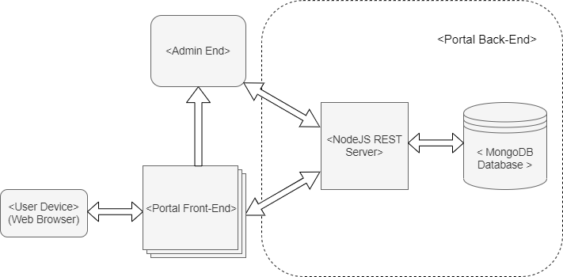
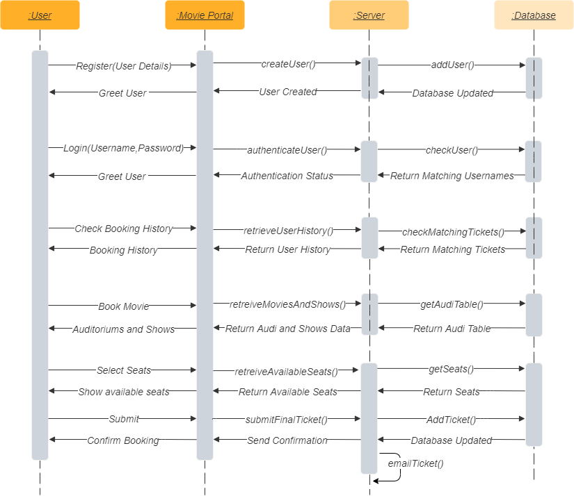
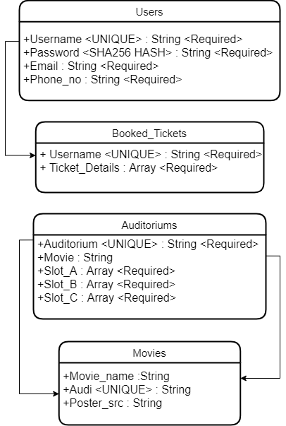

Movie Booking Portal

Entry point : src/app.js

Backend Files : src/

Frontend Files : public/

Database Files : Databases/

[comment]: <> (Design Document Link: https://quip-amazon.com/dBVIAPbwUrTD/Movie-Booking-Portal / https://w.amazon.com/bin/view/Main/Movie_Booking_Portal/)

# _Movie Booking Portal_

[comment]: <> (Wiki Link : https://w.amazon.com/bin/view/Main/Movie_Booking_Portal/)
[comment]: <> (Code Browser Package Link : https://code.amazon.com/packages/Movie_Booking_Portal/trees/heads/master)

1. *Project Requirements*

1.1 Project Overview:

Design and develop a movie booking portal for your city. The system should work for given admin and user use-cases under listed assumptions.

1.2 Assumptions:

    * There is only one movie per auditorium.
    * There are 50 seats per auditorium.
    * Payment is not required to book the movie ticket.
    * There are only three slots per day [9AM, 2PM, 7PM]
    * There are only three auditoriums.
    * A user should not be allowed to book more than 6 tickets per show. 
    * The system should validate user related information while booking or registration.

1.3 As a user…..

    * I should be able to register in movie booking portal with my name, email and mobile number.
    * I should be able to list all the available movies.
    * If registered, I should be able to book the movie ticket without any additional information.
    * If not registered, I should be able to book the movie ticket with my name, email and phone number.
    * The movie ticket should have the movie name, timing and seat number.
    * I should be able to see my booking history.

1.4 As an admin…….

    * I should be able to add/remove a movie.
    * I should be able to add/remove auditorium.

2. *Detailed Design*

2.1 High Level Design Layout

The movie booking portal consists of 3 interfaces/pages:

    * *Login Page*: 
        * The user on visiting the website will be given the option of “Login” and “Register” and the user can click the corresponding button, depending on whether he/she is registered or not. 
        * If “Login” is selected then after taking the input for username and password the authentication request is sent to the server and if the credentials match, then the user is allowed to enter the portal, or else an error is alerted to the user. 
        * If the user is new and “Register” is selected then after taking the required details input from the user, a create user request is sent to the server which adds the new user to the database. 
        * After entering the portal the user is presented the option to check his/her booking history or to book a ticket. If the user requests the history then his/her past tickets are requested from the server and displayed on the same page. 
        * There are some special credentials linked with the admin user and if that are entered at the time of login then the admin auditorium and movie controls are presented on the page.
    * *Available Shows and Movies Page:* 
        * On selecting the option to book a ticket the user is sent to this page where the available movies are listed for the user to choose from. After the user selects a movie the available shows are presented corresponding to the day selected by the user. Also the available movies poster are present on the top of the page. 
        * The user selects the auditorium and time slot and then a request is made to the server to fetch the available seats for this show.
    * *Seat select Page:* 
        * The user is then presented this page where user can choose the seats of their choice from the seat matrix. 
        * Finally the user can hit the submit button present on the page in response to which the entire ticket information is sent to the server which stores this in the database and locks the requested seats and also mails the ticket to the user email address.
* Operational Excellence Page:

Apart from the above 3 pages available for the user , an operational metric page exists to be accessed by the admin , containing various operational metrics which can be monitored by the Admin to continuously check the health of the movie booking portal. This page contains the following live metrics :

        * Status Codes -  displays the frequency of all the 4 series of status codes being sent by the server namely, 2XX,3XX,4XX and 5XX series. 
        * Requests per second - displays the number of requests being handled by the server per second.
        * Response Time - displays average response time taken by the server to respond to the requests. Extremely high response times will signify some error has occurred and will require admin attention.
        * Time spent in event loop - displays the time spent inside any callback/API by the server. Any extremely high readings in this graph will signify that the server has got stuck inside any callback and therefore requires attention.
        * One minute load average - displays the traffic load currently handled by the server.
        * Heap usage - displays the amount of memory used by the functions currently being executed by server .
        * Memory usage - displays the overall memory used by the back-end programs.
        * CPU usage - displays the utilization of the cpu thread by node.js in back-end.

2.2 Sequence Diagram

2.3 APIs Used
 
FrontEnd:

    * createUser()
    * authenticateUser()
    * retreiveBookingHistory(username)
    * retreiveMoviesAndShows()
    * retreiveAvailableSeats(auditorium,time_slot,day)
    * sendFinalTicket(username,auditorium,movie,slots,day,seats)
    * addmovie(movie,auditorium,poster_src)
    * deleteMovie(movie,auditorium)

BackEnd:

    * addUser(username,password,email,phone_no)
    * checkUser(username,password)
    * checkMatchingTickets(username)
    * getMoviesInfo()
    * getSeats(auditorium,slot_time,day)
    * submitFinalTicket(username,movie,auditorium,slot_time,day,seats)
    * emailTicket(username,movie,auditorium,slot_time,seats)
    * addShow(movie,auditorium,poster_src)
    * removeShow(movie,auditorium)
    * dailyAudiTableUpdate()

2.4 Tech Stack 

FrontEnd:

            * HTML: Hyper Text Markup Language (HTML) is a syntax used to format a text document on the web. It is supported by all web browsers. 

            * CSS: CSS is a style sheet language used for describing the look and formatting of a document written in HTML.

            * JavaScript: Javascript is a dynamic computer programming language. It is used as part of web browsers, whose implementations allow client-side scripts to interact with the user, control the browser, communicate asynchronously, and alter the document content that is displayed.  In the movie portal , using nodejs , javascript is being used to program both the front-end and back-end.

            * ReactJS: ReactJS is an open-source JavaScript library that is used for building user interfaces specifically for single-page applications. It allows to create large web applications that can change data, without reloading the page. React is being used here, for dynamically rendering page elements without reloading.

BackEnd: 

            * Node.js: Node.js is a cross-platform, JavaScript runtime environment. It is built on Chrome's JavaScript runtime for easily building fast and scalable network applications. In the movie portal, nodejs will be used for creating the server, handling HTTP requests and handling the database.
            * Express.js: Express.js is a web application framework for node.js that provides a minimal interface to develop effective web applications and APIs. In the movie portal, express will be used for efficiently listening and handling HTTP requests from the client side.
            * MongoDB: MongoDB is an open-source No SQL document database that is highly scalable and fast. In the portal , Mongoose is being used as the ODM (Object Document Mapper ) over MongoDB to make schemas and models.

Advantages of current tech stack: 

    * The above tech stack is open source, has a steep learning curve and allows a low time to productivity, so the development part can start quickly and the project can be completed in the limited amount of available time.
    * Node.js 
            * Has an asynchronous I/O and has in-built handling of multiple concurrent requests.
            * It can be scaled up for making multiple servers using node clusters.
            * Provides code uniformity as Javascript can be used for front-end and back-end both.
    * MongoDB 
            * Highly scalable (over 100K transactions/second) 
            * Secure from injection attacks 
            * Allows locking at the global level which helps prevent collisions between concurrent ticket bookings when multiple server clients are accessing the database.
            * Supported by multiple languages and therefore no need to change database even if back-end is changed.

Limitations of current tech stack : 

    * Although Nodejs has an asynchronous I/O which allows for highly efficient use of single threaded execution and allows making node clusters to leverage use of multi processing, Nodejs does not allow use of multi threaded programming.
    * In the current tech stack, server side React is being used for dynamic rendering of components which is fast when page is loaded but initial page loading times are a bit slow.

2.5 Database Structure

There are 4  in total that will be maintained by the MongoDB database , namely Users Table, Booked Tickets Table, Auditoriums Table and Movies Table :

2.6 Error Handling
Following are the main errors which were identified in the portal and were ,thus, addressed later :

    * Sqlite was chosen earlier as the database which posed the problem of not being scalable. Hence,the database was changed later to MongoDB which can be scaled efficiently both horizontally and vertically , secure from various attacks and provides locking mechanisms to handle requests from multiple back-end servers.
    * Operational metrics were added to enable real time monitoring of the health of the movie booking portal.The details for the added metrics are mentioned in the high level design section above.
    * Added DOM sanitization to input fields at various places at the portal which helped in handling of bad inputs from users. Added validations include :
        * Empty fields and special symbols are not accepted unless stated otherwise at the portal. Alerts are displayed to the user in any such case.
        * Inputs like email and phone number are validated before adding to the database.Invalid email addresses and phone numbers are not accepted and the user is alerted.
        * Inputs given by the user are DOM sanitized so as to prevent execution of any malicious scripts entered by the user.
    * Improved auditorium handling at the admin control page including adding upper limit for adding auditoriums.Following validations are added:
        *  Admin cannot add more than 4 auditoriums at a given time. 
        * A movie cannot be added to more than one auditorium at the same time. Alert is given to the admin if any existing movie is being added.
        * Movie poster URLs are validated and invalid URLs are alerted to the admin.
        * A soft alert is given to the admin if the show requested to be canceled , already has bookings made against it.
    * Resolved the 6 seats per show requirement which now locks the user to book only 6 seats per show and not per transaction. Validations added :
        * Any request to book more than 6 seats of any show is not accepted by the portal and an alert is reported to the user.
        * Requests for booking tickets booked by someone else at the same time are also not accepted and corresponding alert is given to the user.

2.7 Future Work/Limitations 

    * Currently the user details are being saved in the Client-end after login for use by the movies page and the seats page. A more complicated system like JWT, OAuth etc. can be employed to allow secure use of user credentials by movies and seats pages and can also allow secure verification of user.
    * A feature of ‘coming soon’ movies can be added. Currently all the fields are necessary and it is necessary to supply a movie with an auditorium.
    * For the case of multilingual movies available at the portal the option of filtering available movies by language and other attributes like genre,etc. can be added.

